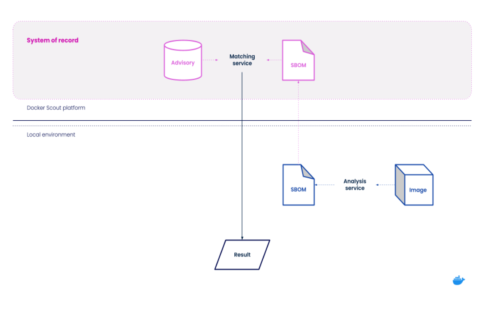
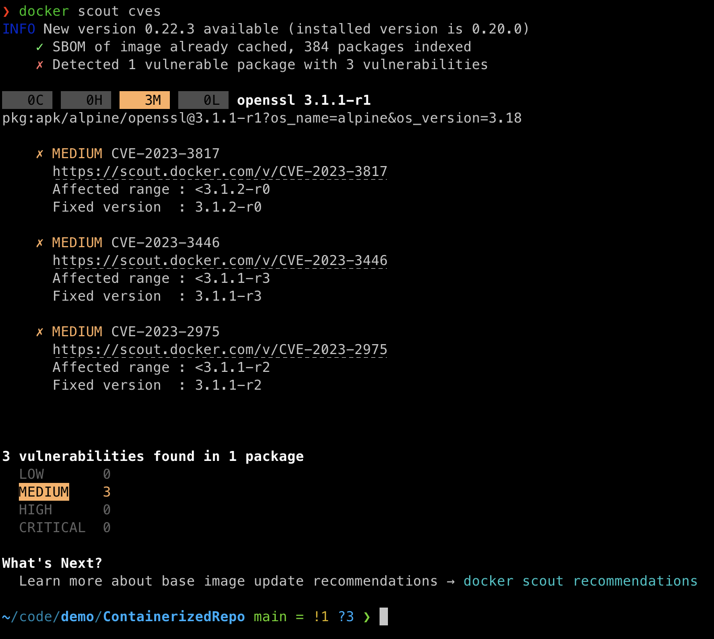
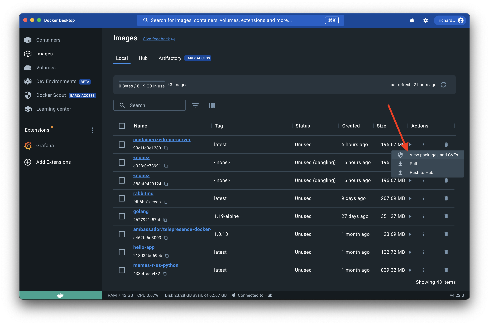
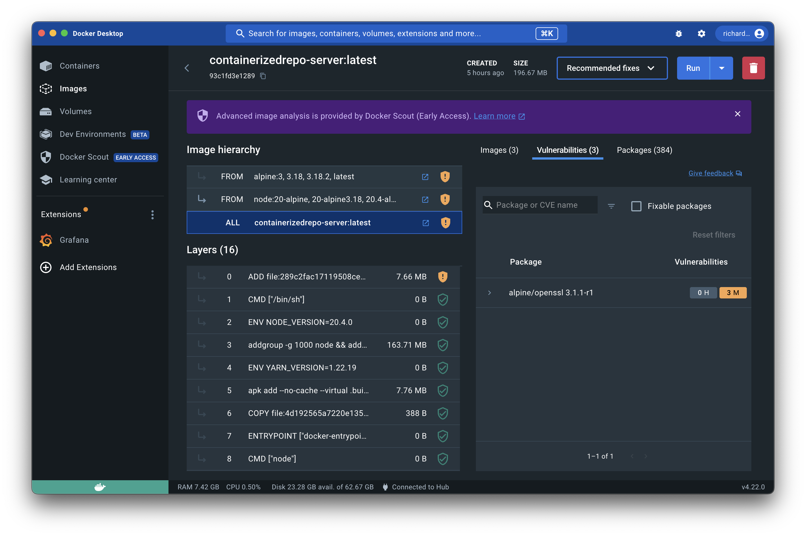
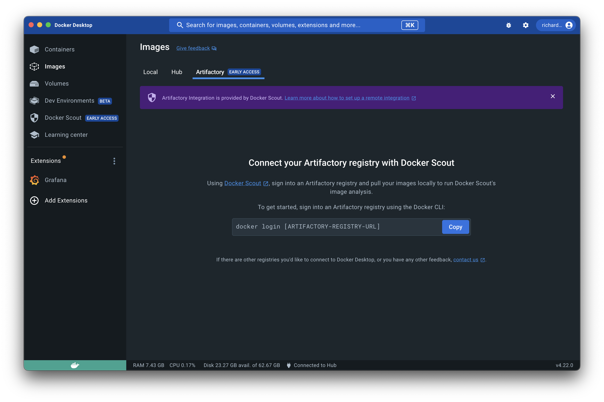
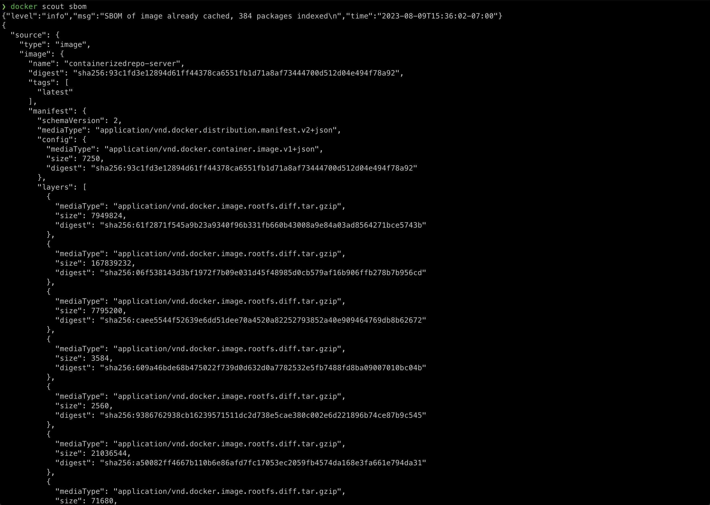

# Scout Data Transmission Overview

We understand that organizations are sensitive about what data is transmitted outside of their network. This overview is intended to inform you of when and how Docker Scout transmitts data to our cloud based services so that you may make an educated decision about your usage of it.

## Architecture

## When does transmission happen?

### Causes external transmission of data
* Examining for CVEs:

### Does __not__ cause external transmission of data
* CLI based SBOM generation

## What Metadata do we store?

* Docker/OCI image metadata
    + Image creation timestamp
    + The digest of the image
    + Ports exposed by the image
    + Environment variable name / value
    + Name and value of image label
    + Image layer ordering
    + Hardware architecture
    + Operating system, and version
    + Registry URL, and type
-----
* Software Bill of materials metadata
    + Advisory Prefix URL (PURL)
    + Package author, and description + License IDs
    + Package name, and namespace + Package scheme, and size
    + Package type, and version
    + File path within the image
    + The type of direct dependency
    + Total count of packages

#### The complete list of metadata stored can be found [here](https://docs.atomist.services/data/sbom/)
-----

## Where is it stored?

* [Amazon Web Services (AWS)](https://aws.amazon.com/) on servers located in US-EAST, USA
* [Google Cloud Platform (GCP)](https://cloud.google.com/) on servers located in US-EAST, USA